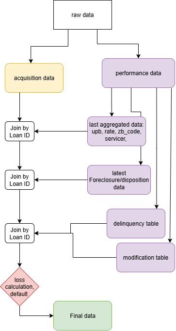

## Loss Severity Modeling of Single-Family Residential Mortgage Loans

This project incorporates a deep investigation of mortgage loan data extracted from Fannie Mae. The goal of this project is to predict the loss given default using different predictors, including macroeconomic parameters. The project can be divided into two main segments sequentially. The first is feature engineering through exploratory data analysis and data cleaning. The second part includes applying Machine Learning models, evaluating them, and comparing results to improve accuracy.

Mortgage loan data analysis is very relevant because mortgage loans are among the most widely sold credit products and deeply influence the financial industry. Analyzing mortgage loans also provides important insights into credit risk modeling, as many credit derivatives issued by lenders are structurally similar to mortgage loans.

### Data Extraction - Feature Engineering 

🟦 Acquisition Data (static loan characteristics)

These variables describe the loan at origination and do not change over time. They include:
1. Loan details – Original unpaid principal balance (UPB), original loan term (months), origination date, first scheduled payment date, original loan-to-value (LTV) and combined LTV ratios, purpose of loan (purchase, refinance, etc.)
2. Credit details of borrower – Number of borrowers, debt-to-income ratio at origination, borrower(s) credit scores, first-time homebuyer flag
3. Lender details – Origination channel (e.g., broker, retail, etc.), original interest rate (%)
4. Property details – Property type (single-family, condo, etc.), number of units, occupancy status (owner-occupied, investor, etc.)
5. Geographic identifiers – State, ZIP (3-digit), MSA
6. Mortgage insurance – Coverage percentage and type (mi_pct, mi_type)
7. Product type – Fixed, ARM, etc. (prod_type)

Indicator flags – HomeReady program, relocation loans, property inspection waiver, high balance loans, HLTV refinance option (hrp_ind, relo_flg, prop_ins_ind, hbl_ind, hltv_ref_ind)

🟧 Performance Data (dynamic loan status over time)

These variables track monthly loan performance until termination. They include:
1. Current reporting period
2. Current servicer of the loan
3. Current interest rate (curr_rte), current unpaid principal balance
4. Loan age (months since origination), remaining months to maturity (scheduled and adjusted)
5. Delinquency status (0 = current, 1+ = months delinquent)
6. Modification indicator (Y/N)
7. Zero balance code and effective date (reason loan ended)
8. Last paid installment date
9. Foreclosure and disposition dates (if applicable)
10. Foreclosure and property holding expenses, net sales proceeds, and other recovery proceeds
11. Non-interest bearing UPB and principal forgiveness amounts
12. Last UPB at zero balance

#### Derived Features (aggregated from monthly data)

We derive features from the performance data and append them to the acquisition data. These features represent flattened components of the time series loan performance, which would otherwise require explicit time series modeling.



#### External variables added 
Additional predictive variables were included, such as the Housing Price Index (HPI). We also incorporated mark-to-market LTV measures.

### Prediction models - Improving Accuracy
The first model implemented was linear regression, which served as a benchmark for the predictive power of the derived features and external variables. Once we finalized the feature set, we proceeded to improve prediction accuracy using machine learning models. For evaluation, the data was divided into training and testing sets.

1. Linear regression assumes linearity, additivity, and homoscedasticity—which rarely hold with real-world tabular data.

2. Random Forest (RF): Bagging—build many deep, independent trees on bootstrapped samples; average predictions. 
✅ Pros: Random Forests handle non-linearities, interactions, and categorical splits much better.
        : robust, handles missing interactions, interpretable via feature importance.
❌ Cons: can be slower, less accurate than boosting on structured data.

3. XGBoost (XGB): Boosting—build many shallow trees sequentially, each correcting prior errors with shrinkage.
✅ Pros: usually higher accuracy than RF, great for tabular data.
❌ Cons: more hyperparameters to tune.

### User Guide

Downlod data from - [Data-dynamics](https://www.fanniemae.com/data-dynamics), Login to- pingone and go to - 'Historical Loan Credit Performance Data'. On the left side menu click on Download data. Clikc on all the desired Quaterly datasets to start download.

The Driver_code.R sources the feature Engineerin- Data Extraction code. Alter these variables to rund the extraction for the years of data that you downloaded.
```bash
starting_file <- x # x= (start_ year - 2000) x 4 + Quater -1 , Eg - 2000Q1 is 0
ending_file <- y #  y= (end_ year - 2000) x 4 + Quater -1 , Eg - 2023Q4 is 95 
```

The notebooks are self explainatory and simpel to use. Find the line and change the year values in there-
```bash
years = list(map(str, range(2004, 2007)))
```